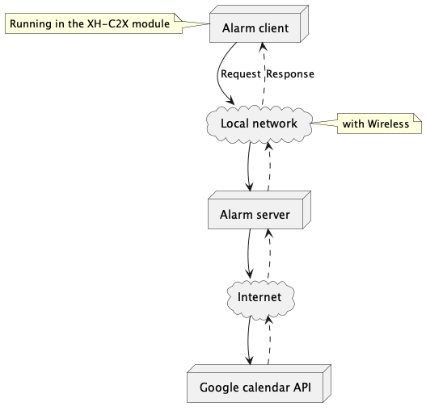

# Google Calendar alarm

A physical alarm for Google Calendar.

## Background

Sometimes it's handy to be alerted of incoming meetings in **Calendar**.
Specially if for any reason you cannot hear the notification sound from your computer.
In such situations an external device that you can sit on your desktop and produces some sort of alarm can be a good solution.
For this reason I've built a small device based on a `XH-C2X` module powered by a `ESP32C2`/`ESP8684H4` 2.4GHz WiFi/BLE module.

This is a personal proyect and I've done my best to document everything.
If you try to build this project yourself you may find out there are documentation gaps.
Please feel free to create a ticket and I'll respond whenever possible.

## Concept

The `client` periodically requests for the calendar status to the `server`. Which makes a request to **Google Calendar API** for the events in the next five minutes (or a different configured time window). If there are events in such timeframe the `server` returns **true** to the `client` and the alarm goes off for the configured time.

Subsequent requests won't return true unless **new events** appear in the time window. Those events for which an alarm was triggered won't make the alarm go off again.

## Server

It's a **Java Spring boot** application acting as a *RESTful* server exposing one endpoint.
The client can query the endpoint in order to know if the alarm should be enabled.
Once the server returns a `true` for a calendar event it won't take the event into account in the following requests.
The events for which a `true` is returned depend on the server logic.

> You need to create a **Google API client** with **Google Calendar** access and provide the secret file to the server [as documented here](server/README.md).

## Client

It's a C application built using **ESP-IDF framework**.
It's configured during the build with a server hostname and a _WiFi_ network and password.
On start up the client connects to the network, resolves the hostname using **mDNS** and starts polling the server.
If the server returns `true` the client activates the alarm for some (configurable) time.

## Hardware

The schematic [can be viewed here](hardware/schematic.png). It consists of the following high-level modules:
- XH-C2X module containing the ESP32C2 chip, antenna, crystal oscillator and a few other passives
- TP4056 battery charger (with protection)
- HT7333 low-dropout 3.3v regulator
- A transistor, LED and a couple of resistors to activate the vibration motor

No PCB has been designed, instead components were mounted into a perfboard and connected with enameled wire. 

## Acknowledgment

Thank you [Gzalo](https://github.com/gzalo) for all the help with the hardware (designing, buying, soldering).